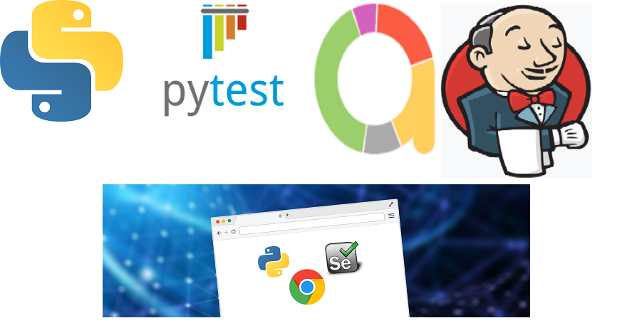
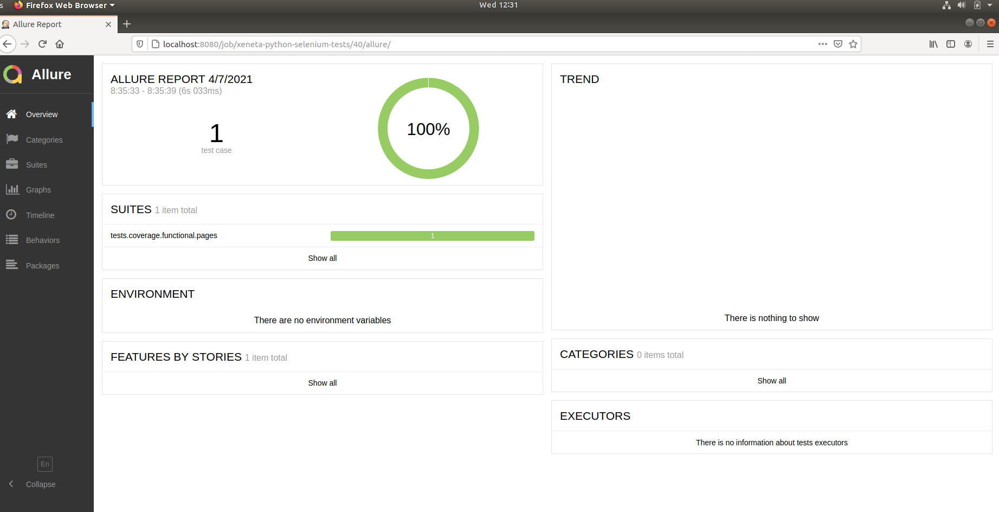
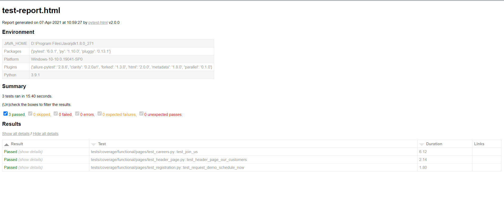

# Python page object model (PyPOM)

> Automated tests are demonstrated on 
> https://www.xeneta.com/demo 
> https://www.xeneta.com/careers
## Tools

- python 3.6, 3.7, 3.8, 3.9
- [pytest](https://pypi.org/project/pytest/) framework
- [selenium](https://selenium.dev/) library
- [allure](https://docs.qameta.io/allure/) reporting
- [docker] (https://docker.io/) headless automation
- [jenkins](https://www.jenkins.io/) continous testing

## Quick start
From the root directory of your shell follow the below steps:

1. Clone the repository
2. Configure `git` for the first time after cloning with your `name` and `email`
3. `pip install -r requirements.txt` to install all project dependenciesc
4. In Linux run below bash script to change permission of webdriver executable
>	`sh linux_setup.sh`
5. to run tests
>  	`pytest -m smoke`

## To run tests without requiring any setup, please use jenkins hosted in azure vm
Open the url http://40.80.88.6/

1. Run the job Spin-Up-Browsers-in-Docker-for-selenium-Tests to spin up headless browser instances
2. Run the job Xeneta-Run-UI-Selenium-Test to run the tests
3. Navigate to the Allure report section in under the UI test job to view the test results

## Allure report

## Local report in test-report.html

Open `test-report.html` file to see detailed testing report e.g:

## Other repositories
python-selenium-hub-docker-dev 
> https://www.xeneta.com/demo 

xeneta-jenkins
> https://github.com/sonups/xeneta-jenkins

### Meta
Author – Sonu Sadasivan.

You can reach out me at:
* [sonu.sadasivan@gmail.com](vyahello@gmail.com)
* [https://github.com/sonups](https://github.com/sonups)
* [https://www.linkedin.com/in/spnups](https://www.linkedin.com/in/sonups)

